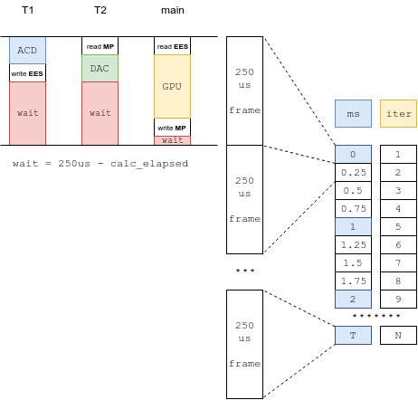

## How to connect a DAC device to the computer and install drivers

### Instruction for linux users:

* **connect** the device (e.g. E-154) to the computer
* **run** ```lsusb```. You must see a new device (usually it is *Philips (or NXP)*)
* **download** a driver from: http://www.lcard.ru/download/lcomp_linux.tgz
* **unzip** and **move** to this folder (or create another one and copy these files to the new directory)
* **copy** ```lcard.rules``` file to the ```/etc/udev/rules.d/``` 
* **uncomment** the line ```#define LCOMP_LINUX 1``` in the ```include/stubs.h``` file
* ```sudo make```
* ```sudo ./start```. Every time after rebooting (!)
* ```ls /dev``` and **check** if ldevice0-4 exist
* ```cd lcomp/```
* **replace** the line ```strcpy(szDrvName,"/dev/ldev");``` to ```strcpy(szDrvName,"/dev/ldevice");``` in the *ldevbase.cpp* file.
* ```make```
* **copy** the compiled *liblcomp.so* to the ```test/``` folder
* ```cd ../test```
* ```make```
* ```sudo ./test 0 e154``` (the second argument depends on the model)

### Timeframe diagram




### In progress ...
