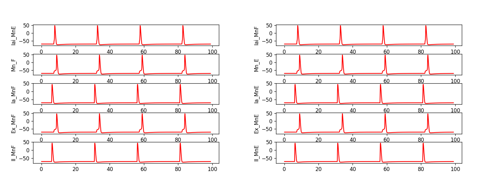

## Model

Model of the reflex arc

Figure 1. 
Extensor and flexor motoneurons "Mn-E" and "Mn-F,"
 excitatory and inhibitory interneurons "Ex" and "Iai",
  afferent fibers "II" and "Ia". 

Afferents "II" and "Ia" connect with generators (40 Hz).
Afferents "II" excite glutamine excitatory interneurons,
 that have excite motoneurons.
Also "II" excite inhibitory interneurons,
 which in turn inhibit GABA another inhibitory interneuron and motoneurons.
Afferents "Ia" excite  motoneurons and inhibitory interneurons.

Figure 2. 
Afferent fiber "Ia" excites motoneuron and triggers depolarization,
 but it doesn't reach the threshold, 
 because at the same time inhibitory interneuron "Iai" inhibits this motoneuron.
Indicated in the graph "Mn_F" and "Mn_E".
Afferent "II" excites excitatory interneuron "Ex",
 which in turn excites motoneuron and triggers a spike.
The algorithm is repeated 3 more times and then time of simulation finished.