# Scheme with hidden generators

## Abstract

This topology represents the second level scheme with hidden generators with neural groups connected by the rule "1-to-40", not "1-to-1", as before.  

There is no "natural" ia-afferents activity here because we observed that all affernets in our data spiking together with a rate closed to 40Hz. That works just as our simulated EES, so if we use both of them, we face the next problem: ever EES and ia-activity will merge without any additional effect or will work just as double rate EES. Also, obviously, there are a lot of middle variants.  
This question have to be duscused.

## Topology

## Switching rate

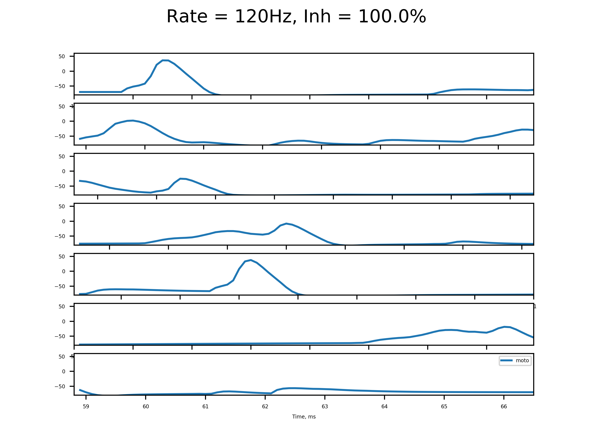
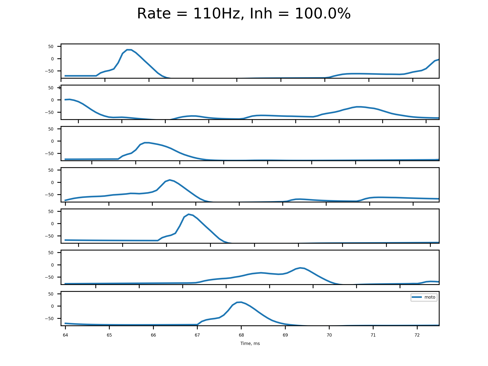
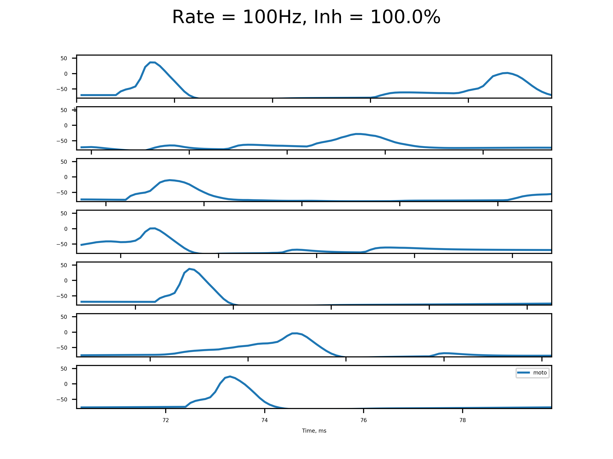
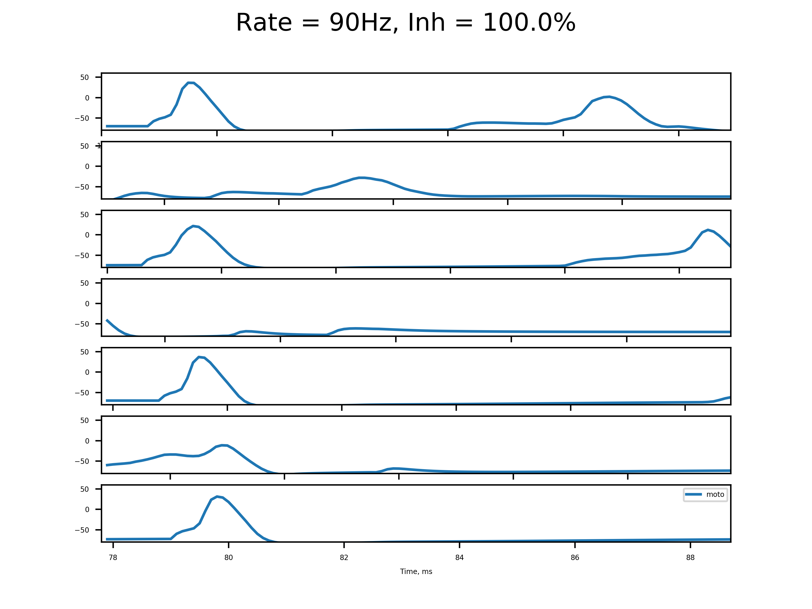
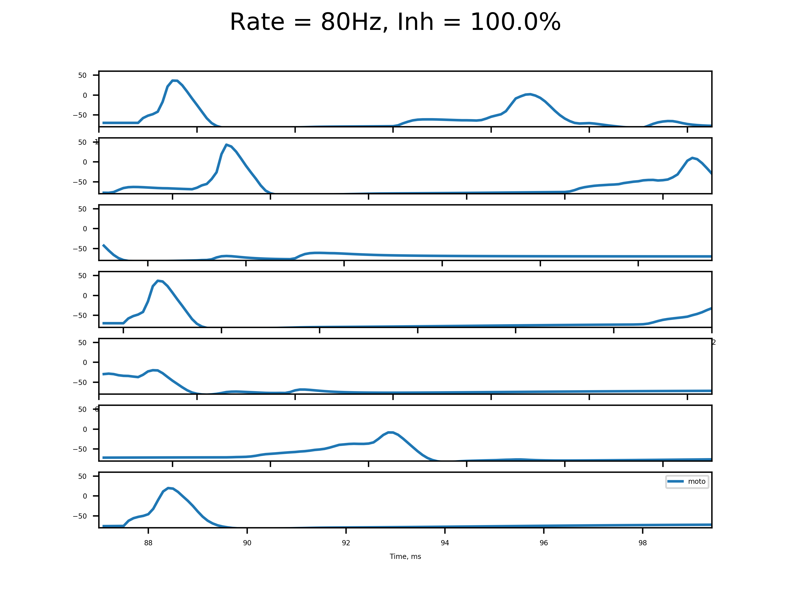
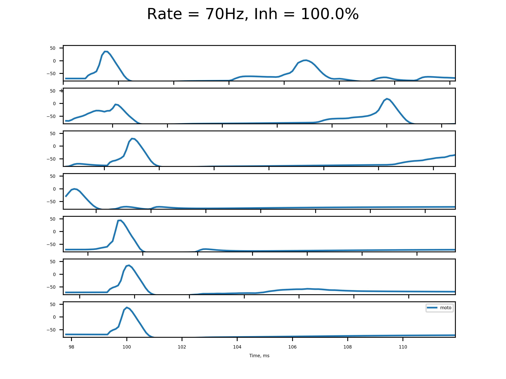
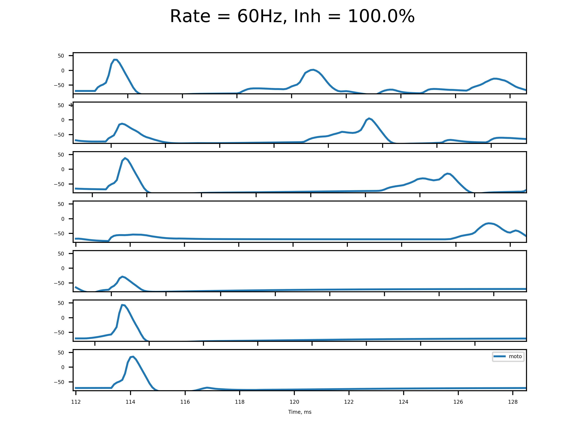
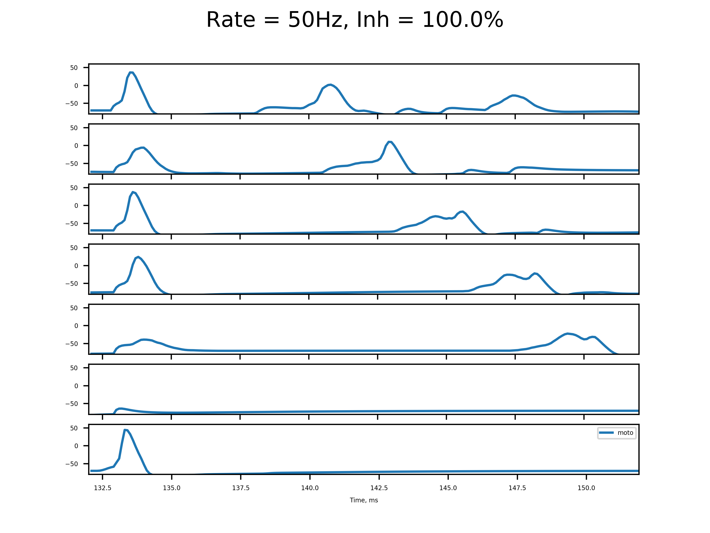
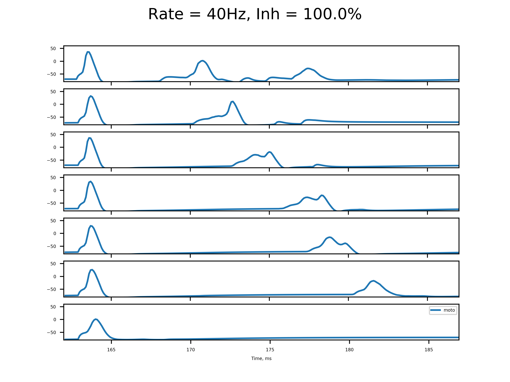
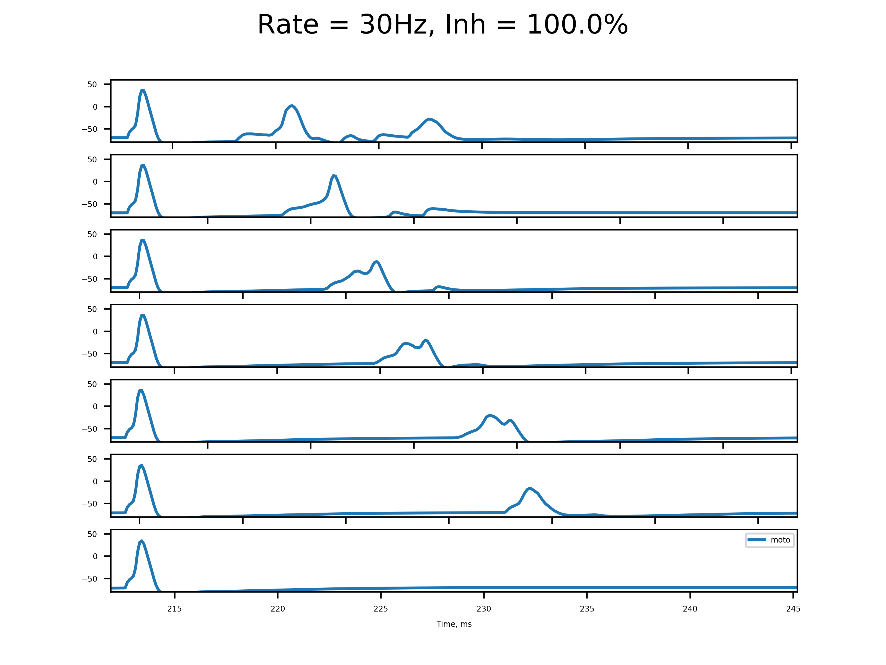
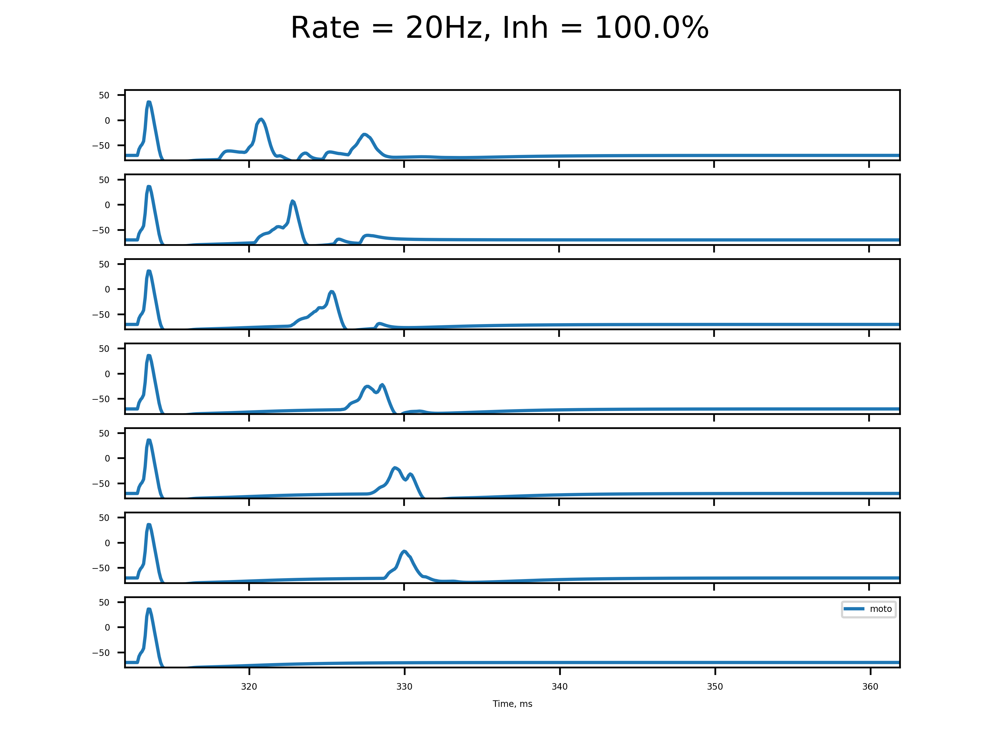

## Changing inhibitory force

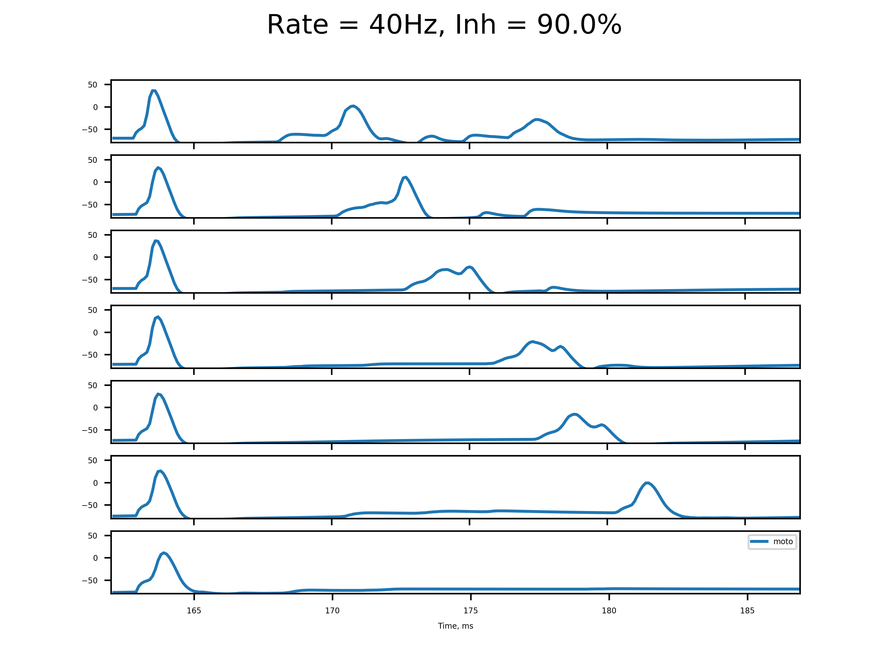

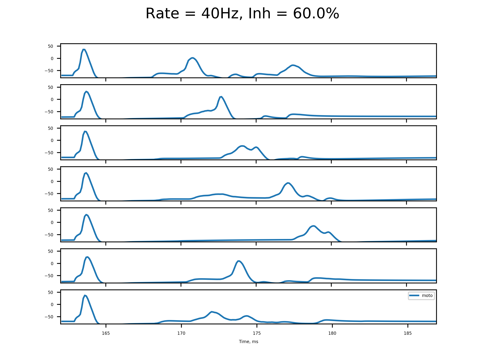
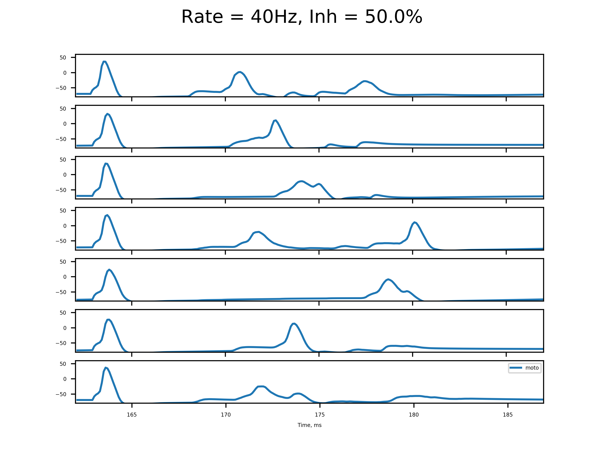
