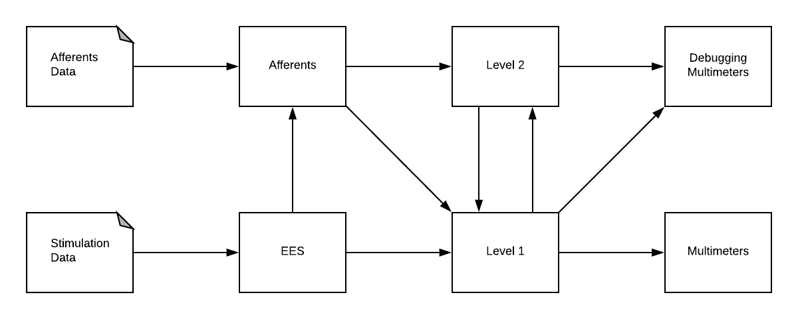
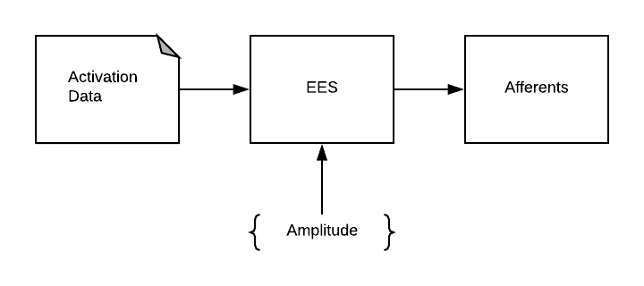

# The Spinal Cord simulation

## 0. Intro

This model is used to simulate the S1 segment of the spinal cord. It consists of several logical parts.
Let's go from left to right follow the data flow.

1. **Afferents Data**. The .txt files contain the experimental data gathered by
[Moraud's team](http://linkinghub.elsevier.com/retrieve/pii/S0896627316000106).
Each file represented as 60 rows respectively for 60 afferents.
Each row contains a list of frequencies, each value corresponds an interval of 20 milliseconds.
2. **Afferents**. The _Afferents_ are several classes purposed to transform the _Afferents Data_ into a list of
spike times for NEST spike generators which represent II and Ia afferents.
3. **Stimulation Data**. These datafiles contain info about how many percents of afferents take a part in
stimulation actions.
4. **EES**. Performs an 'Electric Stimulation' which acts on a specific number of afferents noted in _Stimulation Data_.
5. **Level 1**. Two grand groups of alpha-motoneurons and four interneuronal groups. Stimulated afferents acts on
both motoneuron and interneuronal groups. Links between the _Layer 1_ and the _Layer 2_ are not clear now (12.02.2018).
6. **Level 2**. The level contains 6 layers produces responses with delay between them. Also contains the
interneuronal pool which excitates a specific motoneuron groups (Extensor of Flexor) and inhibits the antagonist-group,
and zero-layer which regulates activity of unterneuronal pool.
7. **Debuggung Multimters**. Just the multimeters, connected to interneurons. This data doesn't need for final results,
but very useful for debugging and weights setup.
8. **Multimeters**. Multimeters connected to the motoneurons. The data gathered by them is the main result.

## 1. Spike times generation

The experimental data consists of lists of frequencies, but for simulation we have to provide a list of spike times
for NEST. The _AfferentSpikeGenerator_ class solves the problem. It generates a list of spike times for an
 every afferent by using the next algorithm:  
There is a `charge` variable which initiated by a zero.
The simulation time divided into equal intervals. The generator calculates an average number of spikes at the interval
and splits the value into two parts: integer part and fraction part. Then the fraction part added to the `charge`.
If `charge` becomes over than `1`, then integer part's value incremented by `1`, and `charge`'s value decremented by `1`.
A number of spikes equaled the integer part placed at the interval aligned to the interval's center with equal
 distance between them.
 
## 2. EES implementation

The main idea is number of activated afferents depends on a stimulation amplitude. A basic principle of the switching
isn't clear now. The algorithm is borrowed and implemented in python by [Alexei Sanin](https://github.com/vogdb).  
